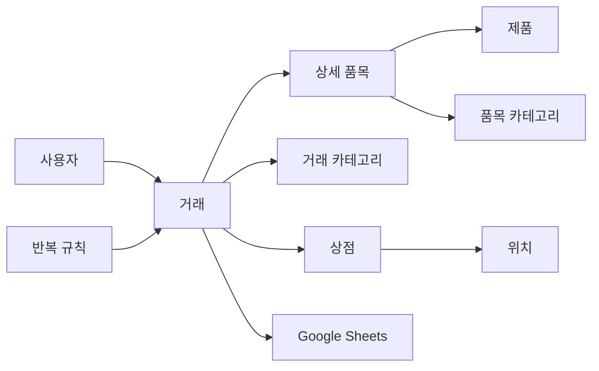
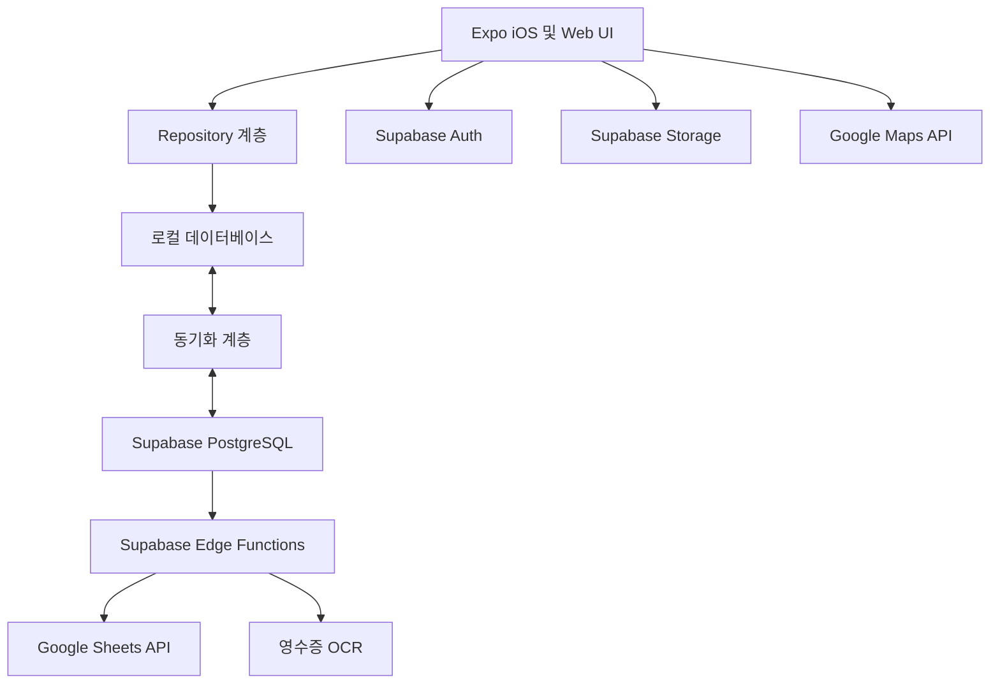

# Pocket Diary 제품 기획서

> 문서 상태: Draft v0.1  
> 작성일: 2026-08-24  
> 대상 플랫폼: iPhone, Web  
> 개발 방식: 1인 개발, VS Code + Codex  
> 첫 주 목표: 상세 품목 기록이 가능한 로컬 우선 MVP

## 1. 제품 요약

### 한 줄 소개

하나의 수입·지출 거래 안에 개별 품목까지 기록하고, 품목별 가격 변화와 재구매 주기를 확인할 수 있는 로컬 우선 가계부다.

### 해결하려는 문제

일반적인 가계부는 `마트 · 식비 · 48,500원`처럼 거래 전체 금액만 기록한다. 이 방식으로는 우유, 세제, 계란처럼 실제로 무엇을 샀는지 파악하기 어렵고, 생필품마다 다른 재구매 주기와 가격 변화도 확인하기 어렵다.

Excel이나 Google Sheets를 사용하면 상세 기록은 가능하지만 모바일 입력이 불편하고, 반복 소비 분석과 자동화 기능을 직접 구성해야 한다.

이 제품은 다음과 같이 거래와 상세 품목을 함께 관리한다.

```text
2026-08-24 · OO마트 · 총 48,500원
├─ 우유 2개 · 5,600원
├─ 세제 · 13,900원
├─ 계란 · 7,500원
└─ 미분류 금액 · 21,500원
```

데이터가 쌓이면 다음 질문에 답할 수 있어야 한다.

- 특정 제품을 언제, 어디서, 얼마에 샀는가?
- 특정 생필품은 평균 며칠마다 구매하는가?
- 같은 제품의 가격이 어떻게 변했는가?
- 이번 달 식비 중 외식과 장보기 비율은 얼마인가?
- 특정 상점에서 누적 얼마를 사용했는가?

## 2. 목표 사용자

- 혼자 거주하며 생활비를 직접 관리하는 사람
- 생필품과 식료품의 구매 주기를 알고 싶은 사람
- 일반 가계부보다 상세히 기록하고 싶지만 스프레드시트 입력은 번거로운 사람
- 월별 소비 데이터를 Google Sheets에도 보관하고 싶은 사람

## 3. 제품 원칙

1. **빠른 입력:** 상세 품목은 선택 사항이며, 거래 총액만으로도 저장할 수 있어야 한다.
2. **거래와 품목 분리:** 결제 전체는 `거래`, 거래에 포함된 제품은 `상세 품목`으로 관리한다.
3. **로컬 우선:** 인터넷이 없어도 기록, 조회, 수정, 삭제할 수 있어야 한다.
4. **앱 데이터가 원본:** 초기 Google Sheets 연동은 앱에서 Sheets로 보내는 단방향 동기화로 제한한다.
5. **자동화 결과 확인:** 반복 거래와 영수증 OCR 결과를 사용자가 수정하거나 제외할 수 있어야 한다.
6. **통계의 정확성:** 거래 금액과 상세 품목 금액을 이중으로 집계하지 않는다.
7. **데이터 최소 수집:** 로그인하지 않은 로컬 모드를 지원하고, 외부 서비스 권한은 기능 사용 시에만 요청한다.

## 4. 범위와 우선순위

### P0: 첫 주 MVP

- 수입·지출 거래 등록
- 거래별 상세 품목 등록
- 거래 조회, 수정, 삭제
- 기본 카테고리 및 사용자 카테고리
- 동일 거래명, 상점명, 제품명 자동완성
- 품목명 검색과 과거 구매 이력
- 반복 거래 규칙과 중복 방지
- 월별 수입, 지출, 잔액
- 카테고리별 간단한 통계
- iPhone과 Web의 로컬 저장
- 로그인하지 않고 사용하는 로컬 모드

### P1: 계정과 클라우드

- 이메일 회원가입 및 로그인
- Google 로그인
- Apple 로그인
- 클라우드 백업과 기기 간 동기화
- Google Sheets 단방향 자동 동기화
- 품목별 평균 구매 간격과 예상 다음 구매일
- 영수증 이미지 보관

### P2: 확장 기능

- 영수증 OCR 자동 인식
- 지도 기반 소비 위치 표시
- 위치별 거래 및 품목 조회
- 같은 제품의 상점별 가격 비교
- Google Sheets 양방향 동기화
- 예산과 반복 소비 알림

### 첫 주 제외 범위

- App Store 정식 심사 완료
- 완전한 클라우드 동기화 및 충돌 해결
- Google Sheets 양방향 편집
- 영수증 OCR의 높은 인식 정확도 보장
- Google 지도 통합
- 추천 또는 예측 모델 고도화

## 5. 핵심 용어

| 용어 | 정의 | 예시 |
|---|---|---|
| 거래 | 한 번의 결제 또는 수입 | OO마트 48,500원 |
| 상세 품목 | 거래 안에 포함된 개별 제품 | 세제 13,900원 |
| 제품 | 반복 검색과 주기 분석을 위한 표준화된 품목 | 특정 브랜드 세제 2L |
| 상점 | 거래가 발생한 판매처 또는 수입처 | OO마트 강남점 |
| 반복 규칙 | 정해진 주기로 거래를 만드는 설정 | 매월 25일 월세 |
| 미분류 금액 | 거래 총액에서 상세 품목 합계를 뺀 차액 | 총액 10,000원 - 품목 8,000원 |

## 6. 화면 구조

### 6.1 홈

- 이번 달 지출
- 이번 달 수입
- 이번 달 잔액
- 카테고리별 지출 요약
- 최근 거래
- 반복 거래 예정
- 빠른 거래 등록 버튼

### 6.2 내역

- 일별 및 월별 거래 목록
- 수입·지출 필터
- 카테고리 필터
- 상점명과 거래명 검색
- 거래 상세 화면
- 거래 수정 및 삭제

### 6.3 품목

- 제품명 검색
- 과거 구매 날짜
- 구매 상점과 위치
- 구매 가격
- 구매 간격
- 평균 구매 주기
- 가격 변화
- 예상 다음 구매일

구매 이력이 3회 미만이면 예상 주기를 표시하지 않거나 `데이터 부족`으로 표시한다.

### 6.4 통계

- 월별 수입, 지출, 잔액
- 카테고리별 지출
- 상점별 지출
- 품목별 누적 지출
- 기간 비교
- 통계 항목에서 상세 거래로 이동

### 6.5 설정

- 카테고리 관리
- 반복 거래 관리
- 계정과 동기화
- Google Sheets 연결
- 데이터 내보내기
- 통화와 언어
- 계정 삭제

### 6.6 Day 1 화면 흐름과 거래 등록 와이어프레임

Day 1에는 Expo Router의 하단 탭으로 다음 기본 흐름을 구성한다.

```text
홈 ─┬─ 내역
    ├─ 품목
    ├─ 통계
    └─ 설정
```

P0 거래 등록 화면은 다음 구조를 기준으로 Day 2~3에 구현한다. 상세 품목 영역은 선택 사항이며 거래 총액만으로도 저장할 수 있어야 한다.

```text
┌─ 거래 등록 ─────────────────────┐
│ [지출 | 수입]                    │
│ 거래명*                          │
│ 총금액*                          │
│ 날짜·시간*       카테고리*       │
│ 상점/수입처      결제 수단       │
│                                  │
│ 상세 품목 (선택)                 │
│ ┌ 제품명 · 수량 · 단가 · 합계 ┐ │
│ └──────────────────────────────┘ │
│ + 품목 추가                      │
│ 품목 합계 / 미분류 금액          │
│                                  │
│ 메모                             │
│                    [거래 저장]   │
└──────────────────────────────────┘
```

## 7. 기능 요구사항

### FR-001 거래 등록

거래는 다음 필드를 가진다.

| 필드 | 필수 여부 | 설명 |
|---|---:|---|
| 수입·지출 유형 | 필수 | `income` 또는 `expense` |
| 거래명 | 필수 | 이전 입력을 자동완성으로 제안 |
| 총금액 | 필수 | 0보다 큰 정수 |
| 날짜 및 시간 | 필수 | 기본값은 현재 시각 |
| 카테고리 | 필수 | 유형에 맞는 카테고리만 표시 |
| 상점 또는 수입처 | 선택 | 이전 입력을 자동완성으로 제안 |
| 위치 | 선택 | 주소, 위도, 경도, Place ID |
| 결제 수단 | 선택 | 현금, 카드, 계좌이체, 기타 |
| 메모 | 선택 | 자유 입력 |
| 영수증 이미지 | 선택 | P1에서 저장, P2에서 OCR |
| 반복 설정 | 선택 | 반복 규칙 생성 |

### FR-002 상세 품목 등록

상세 품목은 다음 필드를 가진다.

| 필드 | 필수 여부 | 설명 |
|---|---:|---|
| 제품명 | 필수 | 기존 제품 자동완성 |
| 품목 카테고리 | 선택 | 비어 있으면 거래 카테고리를 기본 사용 |
| 수량 | 선택 | 기본값 1 |
| 단가 | 선택 | 단가를 입력하면 합계를 계산할 수 있음 |
| 합계 금액 | 필수 | 품목의 실제 반영 금액 |
| 규격 | 선택 | 예: 2L, 500g |
| 메모 | 선택 | 할인, 묶음 상품 등 |

### FR-003 금액 불일치

- `미분류 금액 = 거래 총액 - 상세 품목 합계`로 계산한다.
- 상세 품목 합계가 거래 총액보다 작아도 거래 저장을 허용한다.
- 상세 품목 합계가 거래 총액보다 크면 경고하고 사용자의 확인 또는 수정을 요구한다.
- 할인과 쿠폰은 음수 품목 또는 별도 조정 필드 중 구현 시 한 방식으로 통일한다.

### FR-004 거래 조회·수정·삭제

- 사용자는 본인의 거래만 볼 수 있다.
- 거래 수정 후 월별 합계와 카테고리 통계가 즉시 갱신돼야 한다.
- 거래를 삭제하면 연결된 상세 품목도 함께 삭제한다.
- 클라우드 동기화 이후에는 즉시 물리 삭제하지 않고 삭제 표시를 동기화하는 방식을 고려한다.

### FR-005 자동완성

- 거래명, 상점명, 제품명을 각각 독립적으로 자동완성한다.
- 최근 사용 항목과 사용 빈도가 높은 항목을 먼저 보여준다.
- 문자열이 같아도 제품 규격이 다르면 별도 제품으로 저장할 수 있다.

### FR-006 품목 검색과 구매 주기

- 제품명을 검색하면 구매 날짜, 가격, 상점, 거래 링크를 보여준다.
- 구매 주기는 연속 구매 날짜 간격의 중앙값을 우선 사용한다.
- 구매 이력이 3회 이상일 때만 예상 다음 구매일을 표시한다.
- 예상치는 확정 정보가 아니라 참고 정보로 표시한다.

### FR-007 반복 거래

반복 규칙은 다음 필드를 가진다.

- 반복 주기: 매주, 매월, 매년, 사용자 지정
- 반복일
- 시작일
- 종료일 또는 무기한
- 자동 확정 또는 금액 확인 필요
- 다음 예정일
- 알림 여부

동일 반복 거래가 중복 생성되지 않도록 `(recurring_rule_id, scheduled_date)` 조합에 고유 제약을 둔다.

금액이 변하는 공과금은 자동 확정하지 않고 `금액 확인 필요` 상태로 생성할 수 있다.

### FR-008 월별 통계

- 월별 수입 합계
- 월별 지출 합계
- 잔액 = 수입 - 지출
- 카테고리별 지출
- 상점별 지출
- 품목별 누적 지출

통계 집계 규칙은 다음과 같다.

```text
상세 품목으로 분류된 금액 → 품목 카테고리에 집계
미분류 금액              → 거래 카테고리에 집계
거래 총액                → 위 두 금액과 별도로 다시 더하지 않음
```

## 8. 기본 카테고리

### 지출 13개

1. 식비
2. 장보기
3. 주거·월세
4. 공과금
5. 통신
6. 교통
7. 생활용품
8. 의료·건강
9. 문화·여가
10. 쇼핑
11. 교육
12. 보험·금융
13. 기타 지출

### 수입 5개

1. 월급
2. 부수입
3. 이자·배당
4. 환급
5. 기타 수입

사용자는 카테고리를 추가하고 순서를 변경하거나 숨길 수 있다. 기존 거래에서 사용 중인 카테고리는 실제 삭제하지 않고 비활성화한다.

## 9. Google Sheets 연동

### 기본 구조

사용자당 하나의 가계부 파일을 만들고 월마다 새 탭을 추가한다.

```text
Pocket Diary 가계부
├─ 2026-08
├─ 2026-09
├─ 2026-10
└─ 설정
```

월별 탭에는 다음 세 영역을 둔다.

1. 달력형 일별 수입·지출
2. 상세 거래 및 품목 목록
3. 카테고리별 집계

### 초기 동기화 원칙

- 앱 데이터베이스를 원본으로 사용한다.
- 앱의 변경 사항을 Google Sheets로 보낸다.
- Sheets에서 직접 수정한 값은 앱으로 가져오지 않는다.
- 마지막 동기화 시간과 실패 상태를 표시한다.
- 사용자가 수동으로 다시 동기화할 수 있다.
- Google 로그인과 Sheets 접근 동의는 분리한다.
- 가능한 경우 앱이 생성하거나 사용자가 선택한 파일만 접근하는 `drive.file` 권한을 사용한다.

## 10. 데이터 모델 초안

### 공통 규칙

- 모든 ID는 UUID를 사용한다.
- 모든 사용자 소유 테이블에 `user_id`를 둔다.
- 금액은 원 단위 정수로 저장한다. 예: 12,500원은 `12500`.
- 동기화 대상 테이블에는 `created_at`, `updated_at`, `deleted_at`을 둔다.
- 서버와 클라이언트에서 같은 입력 검증 규칙을 공유한다.

### 주요 테이블

| 테이블 | 역할 | 주요 필드 |
|---|---|---|
| `profiles` | 사용자 프로필 | `id`, `display_name`, `currency` |
| `transactions` | 결제 또는 수입 | `type`, `name`, `total_amount`, `occurred_at`, `category_id`, `merchant_id` |
| `transaction_items` | 상세 품목 | `transaction_id`, `product_id`, `quantity`, `unit_price`, `total_price`, `category_id` |
| `products` | 제품 자동완성과 분석 | `name`, `normalized_name`, `specification` |
| `categories` | 기본·사용자 카테고리 | `type`, `name`, `sort_order`, `is_default`, `is_active`, `created_at`, `updated_at`, `deleted_at` |
| `merchants` | 상점 또는 수입처 | `name`, `normalized_name`, `location_id` |
| `locations` | 위치 | `address`, `latitude`, `longitude`, `place_id` |
| `recurring_rules` | 반복 규칙 | `frequency`, `interval`, `next_run_at`, `requires_confirmation` |
| `receipt_images` | 영수증 이미지 | `transaction_id`, `storage_path`, `ocr_status` |
| `sheet_integrations` | Sheets 연결 | `spreadsheet_id`, `last_synced_at`, `status` |
| `sync_jobs` | 동기화 이력 | `provider`, `status`, `error_message`, `started_at` |

### P0 로컬 스키마 결정

- Web IndexedDB와 iPhone SQLite는 같은 도메인 모델과 Repository 계약을 사용한다.
- 로컬 스키마는 버전형 전진 마이그레이션으로 관리한다. v1은 `transactions`와 `transaction_items`, v2는 `categories`와 기본 카테고리 시드, v3는 자동완성 기준 데이터인 `merchants`와 `products`, v4는 iOS 거래·품목 표시명 스냅샷이다.
- 기본 카테고리 18개는 플랫폼 간 동일한 고정 UUID와 유형별 `sort_order`를 사용한다.
- P0 로컬 모드는 단일 사용자이므로 로컬 테이블에 `user_id`를 저장하지 않는다. 계정 동기화를 도입하는 P1 마이그레이션에서 소유자 연결을 추가한다.
- 사용자가 숨긴 카테고리를 재시드 과정에서 다시 활성화하지 않는다. 사용 중인 카테고리는 물리 삭제 대신 `is_active`와 `deleted_at`으로 비활성화한다.
- 거래명, 상점명, 제품명 자동완성은 로컬 거래를 기준으로 사용 빈도 우선, 같은 빈도에서는 최근 사용 우선으로 정렬한다. 상점과 제품은 정규화된 이름을 저장하고, 화면 재조회용 이름 스냅샷도 거래 aggregate에 유지한다.
- P0 로컬 모드에서 거래 삭제는 사용자 확인 후 거래와 연결 품목을 하나의 저장 작업으로 물리 삭제한다. 공유 기준 데이터인 카테고리, 상점, 제품은 함께 삭제하지 않으며, 자동완성과 구매 이력은 남아 있는 거래만으로 계산한다.
- 월별·일별 거래 목록은 기기에 설정된 현지 시간대를 기준으로 `occurred_at`을 묶는다. 제품 구매 이력은 정규화된 제품명과 규격 조합으로 그룹화해 같은 이름이라도 규격이 다르면 별도로 표시한다.

### 관계



## 11. 권장 기술 스택

### 애플리케이션

- React Native
- Expo 최신 안정 버전
- TypeScript strict mode
- Expo Router
- React Hook Form
- Zod
- Zustand
- React Native Paper 또는 작은 자체 디자인 시스템
- `react-native-svg` 기반의 단순 차트

### 백엔드

- Supabase PostgreSQL
- Supabase Auth
- Supabase Storage
- Supabase Edge Functions
- 모든 사용자 데이터 테이블에 Row Level Security 적용

### 로컬 저장과 동기화

- 우선 검토: PowerSync + Supabase
- UI와 저장소 사이에 Repository 계층 적용
- 첫 개발일에 iOS와 Web 양쪽에서 로컬 저장 및 재동기화 기술 검증
- 기술 검증 실패 시 P0는 로컬 전용 저장으로 제한하고 클라우드 동기화를 P1으로 이동

### 테스트

- 단위 테스트: Jest
- 컴포넌트 테스트: React Native Testing Library
- Web E2E: Playwright
- iOS 핵심 흐름: 실제 기기 또는 Simulator 수동 테스트, 이후 Maestro 검토

### 배포

- iOS: EAS Build, TestFlight, App Store
- Web: EAS Hosting 또는 Vercel
- 백엔드: Supabase
- 소스 관리: Git, 필요 시 GitHub

### 지도와 OCR

- 지도 Web: Google Maps JavaScript API
- 지도 iOS: Google Maps iOS SDK를 지원하는 React Native 모듈을 기술 검증 후 선택
- OCR: 영수증 이미지를 서버 함수로 전송하고 OCR 제공자 응답을 임시 초안으로 저장
- OCR 결과는 사용자 확인 전까지 실제 거래 데이터로 확정하지 않음

## 12. 시스템 구조



## 13. 인증과 보안

- 로컬 모드는 로그인 없이 사용할 수 있다.
- 클라우드 백업과 기기 간 동기화 시 계정 연결을 요청한다.
- Google Sheets 사용 시 별도의 Google 권한 동의를 요청한다.
- iOS 정식 출시 전 Google 로그인과 동등한 Apple 로그인 옵션을 구현한다.
- 계정 생성 기능이 있으면 앱 안에서 계정을 삭제할 수 있어야 한다.
- Supabase 서비스 역할 키와 Google OAuth 비밀 키를 클라이언트 코드에 넣지 않는다.
- 모든 공개 데이터베이스 테이블에 RLS 정책과 정책 테스트를 작성한다.
- 영수증에는 개인정보가 포함될 수 있으므로 비공개 저장소와 사용자별 접근 정책을 사용한다.

## 14. 첫 주 개발 계획

### Day 1: 요구사항과 기술 검증

- 본 문서 검토 및 미확정 사항 결정
- 화면 흐름과 거래 등록 와이어프레임
- Expo iOS 및 Web 프로젝트 생성
- 로컬 데이터베이스와 동기화 방식 기술 검증

완료 조건: iPhone과 Web에서 앱이 실행되고 테스트 거래가 로컬에 저장된다.

### Day 2: 데이터 모델과 공통 UI

- 초기 스키마와 마이그레이션
- 기본 카테고리 시드
- 공통 입력, 버튼, 금액, 날짜 컴포넌트
- 하단 탐색 구조

완료 조건: 주요 화면 이동과 기본 카테고리 조회가 작동한다.

### Day 3: 거래와 상세 품목

- 거래 등록
- 상세 품목 추가·삭제
- 금액 차액 표시
- 자동완성 기초

완료 조건: 상세 품목이 있는 거래를 저장하고 다시 열 수 있다.

### Day 4: 내역과 검색

- 월별 거래 목록
- 거래 상세, 수정, 삭제
- 제품명 검색
- 구매 이력 표시

완료 조건: 거래 CRUD와 제품별 과거 구매 조회가 작동한다.

### Day 5: 반복 거래와 카테고리

- 사용자 카테고리 추가와 비활성화
- 반복 규칙 생성
- 반복 거래 중복 방지

완료 조건: 예정일에 같은 반복 거래가 한 번만 생성된다.

### Day 6: 통계와 반응형 UI

- 월별 수입, 지출, 잔액
- 카테고리별 통계
- 이중 집계 방지 테스트
- iPhone과 Web 레이아웃 점검

완료 조건: 샘플 데이터의 수기 계산과 앱 통계가 일치한다.

### Day 7: 품질 검증과 빌드

- 빈 화면, 오류, 큰 금액, 여러 달 데이터 테스트
- 오프라인 저장과 앱 재실행 테스트
- 접근성 기본 점검
- Web 프리뷰와 iOS 개발 빌드
- 알려진 문제와 다음 버전 작업 목록 작성

완료 조건: 핵심 시나리오가 iPhone과 Web에서 중단 없이 동작한다.

## 15. MVP 인수 조건

- [ ] iPhone과 Web에서 실행된다.
- [ ] 인터넷 없이 거래를 등록할 수 있다.
- [ ] 앱을 재실행해도 로컬 거래가 유지된다.
- [ ] 한 거래에 여러 상세 품목을 등록할 수 있다.
- [ ] 거래와 품목을 조회, 수정, 삭제할 수 있다.
- [ ] 거래명, 상점명, 제품명 자동완성이 작동한다.
- [ ] 제품 검색 결과에 과거 구매 날짜와 가격이 표시된다.
- [ ] 반복 거래가 동일 예정일에 중복 생성되지 않는다.
- [ ] 월별 수입, 지출, 잔액이 정확하다.
- [ ] 상세 품목이 있어도 통계 금액이 이중 집계되지 않는다.
- [ ] 작은 iPhone 화면과 데스크톱 Web에서 주요 UI가 깨지지 않는다.

## 16. Codex 작업 규칙

Codex는 구현 작업 전에 이 문서를 읽고 다음 원칙을 지킨다.

1. P0 범위를 먼저 완성하고 요청 없이 P1·P2 기능을 끌어오지 않는다.
2. 데이터 모델 변경 시 이 문서와 마이그레이션을 함께 갱신한다.
3. 금액은 부동소수점이 아닌 원 단위 정수로 처리한다.
4. 거래와 상세 품목의 이중 집계를 방지하는 테스트를 작성한다.
5. 로컬 저장, 동기화, UI가 직접 결합되지 않도록 Repository 계층을 사용한다.
6. 비밀 키와 토큰을 저장소에 커밋하지 않는다.
7. 사용자 소유 데이터에는 RLS 정책과 권한 테스트를 적용한다.
8. 작업 후 관련 테스트, 타입 검사, 린트를 실행하고 결과를 보고한다.
9. 요구사항이 불명확하면 기존 제품 원칙과 P0 범위를 우선한다.

## 17. 미확정 사항

구현 전에 다음 결정을 순서대로 확정한다.

- [x] 앱 이름과 브랜드 방향 — P0 작업명은 `Pocket Diary`로 확정하고, 차분한 중성 색상의 기록 도구 방향을 사용한다. 로고와 최종 시각 아이덴티티는 P0 기능 완성 이후 검토한다. (2026-08-24)
- [x] 기본 통화를 KRW로 고정할지 다중 통화를 고려할지 — P0는 KRW 단일 통화와 정수 원 단위만 지원한다. 다중 통화는 P0 이후 별도 데이터 모델 검토 대상으로 둔다. (2026-08-24)
- [x] 상세 품목 합계가 거래 총액을 초과할 때의 최종 UX — 초과 금액을 인라인 경고로 표시하고 사용자가 별도 확인 버튼을 눌러야 저장할 수 있다. 총액이나 품목 금액이 바뀌면 확인 상태를 해제한다. (2026-08-27)
- [ ] 할인·쿠폰을 음수 품목과 조정 필드 중 어느 방식으로 관리할지
- [ ] 제품명을 사용자가 직접 병합할 수 있게 할지
- [ ] 반복 거래 생성 시점과 알림 정책
- [x] P0 로컬 DB 및 동기화 기술 검증 결과 — UI와 저장소 사이에 `TransactionRepository`를 두고 iPhone은 `expo-sqlite`, Web은 브라우저 IndexedDB 어댑터를 사용한다. Expo SQLite Web은 alpha이며 별도 WASM·보안 헤더 구성이 필요하고, PowerSync의 React Native Web 지원은 beta이므로 P0에는 도입하지 않는다. P0는 로컬 데이터를 원본으로 유지하고 실제 원격 동기화는 계정·Supabase 구성이 필요한 P1에서 Repository 뒤에 추가한다. (2026-08-24)
- [x] P0 로컬 스키마 버전과 기본 카테고리 식별자 — Web IndexedDB와 iPhone SQLite 모두 v1 거래·품목, v2 카테고리, v3 상점·제품 기준 데이터 순서로 전진 마이그레이션한다. iPhone SQLite는 v4에서 Web과 동일하게 거래 당시 상점명·제품명 스냅샷을 보존한다. 기본 카테고리 18개는 플랫폼 간 같은 고정 UUID를 사용하고, P0 단일 사용자 로컬 테이블에는 `user_id`를 두지 않는다. (2026-08-27)
- [x] 자동완성 기초 데이터와 정렬 — v3에서 상점과 제품 기준 데이터를 추가하며, 로컬 거래의 사용 빈도와 최근 사용 시각으로 거래명·상점명·제품명 제안을 정렬한다. (2026-08-27)
- [x] P0 거래 삭제와 구매 이력 그룹 기준 — 로컬 거래와 연결 품목은 확인 후 물리 삭제하고, 제품 이력은 정규화된 제품명과 규격 조합으로 묶는다. 월별 목록은 기기 현지 시간대를 사용한다. (2026-08-27)
- [ ] Google Sheets 월별 탭의 실제 레이아웃

## 18. 참고 문서

- Expo Router: https://docs.expo.dev/router/introduction/
- Expo SQLite: https://docs.expo.dev/versions/latest/sdk/sqlite/
- Expo iOS 배포: https://docs.expo.dev/tutorial/eas/ios-production-build/
- Supabase React Native Auth: https://supabase.com/docs/guides/auth/quickstarts/react-native
- Supabase Google Auth: https://supabase.com/docs/guides/auth/social-login/auth-google
- Supabase RLS: https://supabase.com/docs/guides/database/postgres/row-level-security
- PowerSync 지원 플랫폼: https://docs.powersync.com/resources/supported-platforms
- PowerSync + Supabase: https://docs.powersync.com/integrations/supabase/guide
- Google Sheets OAuth 범위: https://developers.google.com/workspace/sheets/api/scopes
- Google Sheets 생성 API: https://developers.google.com/workspace/sheets/api/guides/create
- Apple App Review Guidelines: https://developer.apple.com/app-store/review/guidelines/
